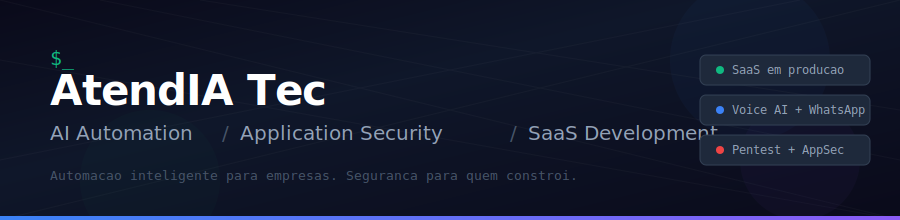

  

  &nbsp;
  &nbsp;
  

---

I'm Gabriel, founder of **[AtendIA Tec](https://atendiatec.com.br)**. I build custom AI-powered systems tailored to each client's business — from voice agents that handle real phone conversations on WhatsApp to full CRM platforms with 130+ features. I also pentest what I build (and what others build) before it ships.

Not a SaaS company. Every project is architected from scratch around the client's workflow, integrations, and goals. Reusable foundations, fully personalized delivery.

---

### What I Do

| Area | Details |
|------|---------|
| **Voice AI Systems** | Custom agents that call, qualify, and schedule via WhatsApp — Deepgram STT, Claude/GPT, ElevenLabs TTS, SIP bridging via Jambonz |
| **Custom Platforms** | Full-stack web apps built to order — CRM, dashboards, automation engines, real-time features, multi-tenant architecture |
| **WhatsApp Automation** | Meta Cloud API integration, inbound/outbound messaging, webhook handlers, media support |
| **CRM & Integrations** | GoHighLevel, Clinicorp — OAuth flows, bidirectional sync, embeddable widgets, calendar booking |
| **Application Security** | Web/API pentesting (OWASP/PTES), GraphQL, auth bypass, IDOR, multi-tenant isolation audits |
| **Infrastructure** | Docker Compose + Traefik, automated staging/production, health monitoring, auto-rollback |

---

### Tech Stack

  
  
  
  
  
  
  
  
  
  
  
  
  
  
  

---

### Current Project Metrics

<table align="center">
  <tr>
    <td align="center"><strong>650+</strong> commits</td>
    <td align="center"><strong>267</strong> source files</td>
    <td align="center"><strong>353</strong> automated tests</td>
    <td align="center"><strong>17</strong> backend modules</td>
  </tr>
  <tr>
    <td align="center"><strong>21</strong> database tables</td>
    <td align="center"><strong>130+</strong> features shipped</td>
    <td align="center"><strong>55</strong> API endpoints</td>
    <td align="center"><strong>16</strong> webhook event types</td>
  </tr>
</table>

---

### How I Work

| Phase | What happens |
|-------|-------------|
| **Discover** | Understand the client's business, map requirements, research integrations |
| **Architect** | Design spec + implementation plan, reviewed before any code is written |
| **Build** | TDD, code review, quality audit at every stage. Nothing ships unchecked. |
| **Secure** | Pentest my own systems before delivery — OWASP methodology, API audits |
| **Deploy** | Staging with automated tests, production with smoke tests + auto-rollback |
| **Iterate** | Monitor, fix, improve. Continuous delivery through staging pipeline. |

---

### Security Research

Penetration testing and security audits following OWASP Testing Guide v4.2 + PTES methodology. Focused on web apps, REST/GraphQL APIs, authentication systems, and multi-tenant isolation.

Active on [YesWeHack](https://yeswehack.com) bug bounty platform.

---

### Open Source

| Repository | What it does |
|---|---|
| **[fastify-multi-tenant-starter](https://github.com/atendiatec/fastify-multi-tenant-starter)** | Multi-tenant backend template — Fastify 5 + Drizzle ORM + JWT + row-level isolation |
| **[pentest-samples](https://github.com/atendiatec/pentest-samples)** | Sanitized pentest case studies — OWASP/PTES, GraphQL/Firebase/REST API findings |
| **[whatsapp-meta-webhook-template](https://github.com/atendiatec/whatsapp-meta-webhook-template)** | Meta WhatsApp Cloud API webhook handler — Fastify + TypeScript + HMAC validation |
| **[bullmq-job-patterns](https://github.com/atendiatec/bullmq-job-patterns)** | BullMQ production patterns — retry, sweeps, webhook delivery, rate limiting |
| **[docker-traefik-ssl-template](https://github.com/atendiatec/docker-traefik-ssl-template)** | Docker Compose + Traefik v3 + SSL — reverse proxy with security headers |

---

  <strong>Need a custom system built for your business?</strong> 
  Voice AI, WhatsApp automation, custom platforms, or security audits — every project is tailored to your workflow.  
  
    
  <em>"Build it right. Then try to break it. Ship only what survives."</em>

