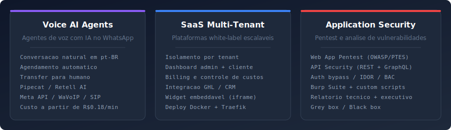
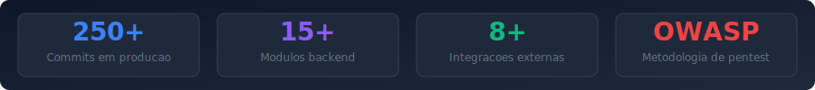
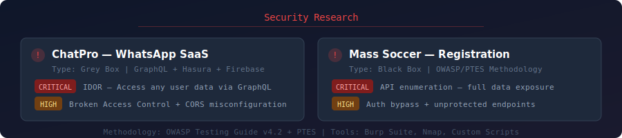
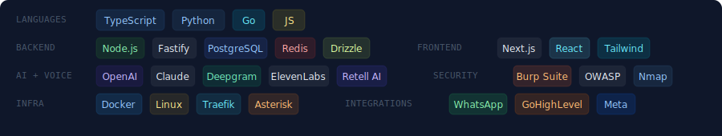

  

  &nbsp;
  &nbsp;
  

---

Founder of **AtendIA Tec** — I build AI-powered platforms that automate customer communication and test them for security before they ship. From voice AI agents on WhatsApp to full multi-tenant SaaS infrastructure, I handle the entire stack: architecture, development, deployment, and security hardening.

  
  

---

  

  

### Security Research

  

### Tech Stack

  
  
  
  
  
  
  
  
  
  

  

### How I Work

| Phase | What happens |
|-------|-------------|
| **Discover** | Understand the problem, map requirements, research integrations |
| **Architect** | Design spec + implementation plan, reviewed before any code is written |
| **Build** | TDD, code review, CTO audit at every stage. Nothing ships unchecked. |
| **Secure** | Pentest my own systems before delivery — OWASP methodology, API audits |
| **Deploy** | Staging with automated tests, production with smoke tests + auto-rollback |
| **Iterate** | Monitor, fix, improve. Continuous delivery through staging pipeline. |

### Areas of Focus

| Area | What I Do |
|------|-----------|
| **Voice AI** | AI agents that handle real conversations on WhatsApp — scheduling, qualification, support |
| **WhatsApp Automation** | Meta Cloud API + SIP bridging for programmatic voice and messaging at scale |
| **Multi-Tenant SaaS** | White-label platforms with tenant isolation, billing, dashboards, CRM integration |
| **Application Security** | Web app pentesting (OWASP/PTES), API security, GraphQL, auth bypass, IDOR |
| **CRM Integration** | GoHighLevel and Clinicorp — OAuth, calendars, conversations, embeddable widgets |
| **Infrastructure** | Docker Compose + Traefik, automated staging/production, health checks, rollback |

### Open Source

  
  

  
  

   
  <strong>Interested in working together?</strong> 
  AI automation, SaaS development, or security audits  
  
    
  <em>"Build it right. Then try to break it. Ship only what survives."</em>

